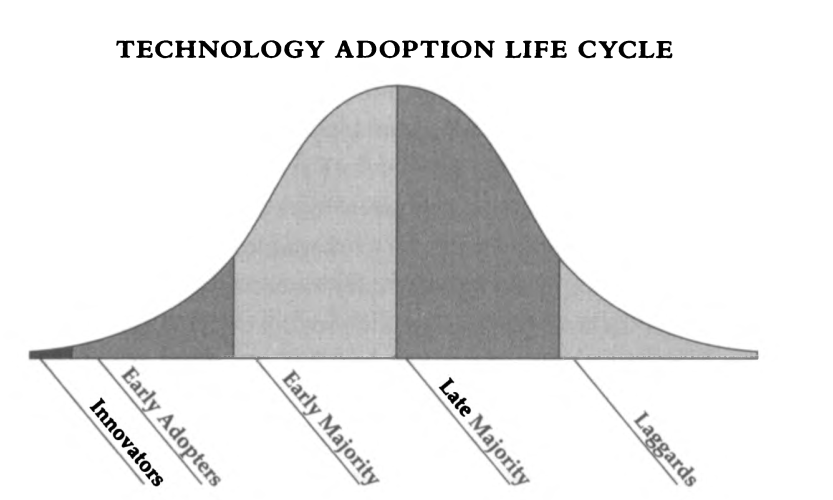

# Reading: Crossing the Chasm

## Part 1: Discovering the chasm

- Defining "the chasm"
   
   The point of greatest peril in the development of a high-tech market lies in making the transition from an early market dominated by a few visionary customers to a mainstream market dominated by a large block of customers who are predominantly pragmatists in orientation. The gap between these two markets, all too frequently ignored, is in fact so significant as to warrant being called a chasm, and crossing this chasm must be the primary focus of any long-term high-tech marketing plan. A successful crossing is how high-tech fortunes are made; failure in the attempt is how they are lost. 
   
- The technology adoption life cycle
  
  A model for understanding the acceptance of new products. 

  Innovations can be either continuous or discontinuous, and high tech is the former. That's why the technology adoption life cycle is important to its marketing. 

  

  The underlying thesis of the technology adoption life cycle is that technology is absorbed into any given community in stages corresponding to the psychological and social profiles of various segments within that community. This process can be thought of as a continuum with definable stages, each associated with a definable group, and each group making up a predictable portion of the whole. 

- The high-tech marketing model
  
  A market model to use each group as a reference base for launching their marketing into the next group. 

## Part 2: Crossing the chasm

### The perils of the chasm

