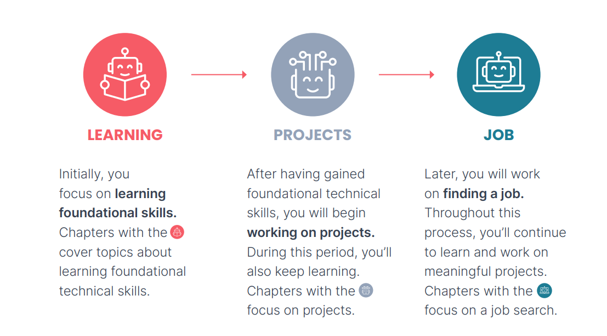

# Reading notes: How to build your career in AI?

- Words enable deep-human-to-human communication. Code is the deepest form of human-to-machine communication.

- Three key steps of career growth are learning foundational skills, working on projects (to deepen your skills, build a portfolio, and create impact), and finding a job.

  

- AI is nascent with many technologies are still evolving while the foundations of machine learning and deep learning are maturing, -and course work is an efficient way to master them.

- Searching for a job in AI can be similar to searching for a job in other sectors, there are also important differences. Many companies are still trying to figure out which AI skills they need, and how to hire people who have them. Things you've worked on may be significantly different than anything your interviewer has seen, and you're more likely to have to educate potential employers about some elements of your work. 

- Technical skills for AI 
  - Foundational machine learning skills: linear regression, logistic regression, neural networks, decision trees, clustering, and anomaly detection. Beyond specific models, it's even more important to understand the core concepts behind how and why machine learning works, such as bias/variance, cost functions, regularization, optimization algorithms, and error analysis. 
  - Deep learning: the basics of neural networks, practical skills for making them work (such as hyperparameter tuning), convolutional networks, sequence models, and transformers.
  - Math relevant to machine learning: linear algebra (vectors, matrices, and various manipulations of them) as well as probability and statistics (including discrete and continuous probability, standard probability distributions, basic rules such as independence and Bayes's rule, and hypothesis testing). 
  - Software development: Your job opportunities will increase if you can write good software to implement complex AI systems. These skills include programming fundamentals, data structures (especially those that relate to machine learning, such as data frames), algorithms (including those related to databases and data manipulation), software design, familiarity with Python, and familiarity with key libraries such as TensorFlow or PyTorch, and scikit-learn. 

- How do your gain these skills? When the goal is deep understanding, reading disjointed web pages is inefficient because they tend to repeat each other, use inconsistent terminology (which slows you down), vary in quality, and leave gaps. So a good course is the most time-efficient way to master a meaningful body of knowledge. 

- A recommended book: Tiny Habits: The Small Changes That Change Everything. Start small and succeed, rather than start too big and fail. 

- Should you learn math to get a job in AI or how much match do you need to know to be a machine learning engineer? It depends on the goal you want to accomplish.  

