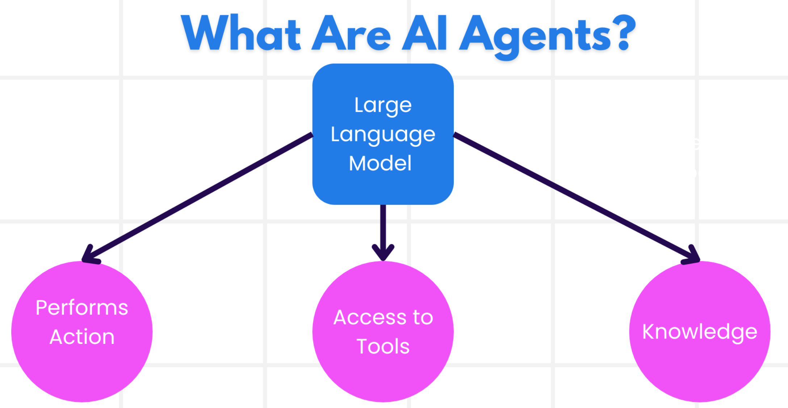

# AI agent reading notes

## AI agent 简介
- 什么是 AI agent，它和其他 AI 解决方案有什么不同
- 什么情况下用 AI agent 效益最大
- AI agent 的基本构件是什么（如何为用户/客户设计好的代理方案）

### 什么是 AI agent
AI agents are **systems** that enable **Large Language Models(LLMs)** to **perform actions** by extending their capabilities by giving LLMs **access to tools** and **knowledge**.

简言之，就是给 LLM 工具和知识，让它自主决策做一些事情。

需要明确的是，AI agent 是一个系统，不是一个组件。作为一个系统，它包括以下：
- 环境：AI agent 运行的环境；
- 传感器：AI 代理使用传感器来收集和解读这些关于环境当前状态的信息（是个啥，实体传感器还是一个软件概念）。
- 执行器：一旦 AI 代理接收到环境的当前状态，代理就会根据当前任务确定执行什么操作以改变环境。比如对于旅行代理的预定来说，可以是为用户预订一个可用的房间。

### AI agent 类型 （没太懂分类的标准是什么）

| **代理类型** | **描述**                                                                                                                       | **示例**  |
| ----------------------------- | ------------------------------------------------------------------------------------------------------------------------------------- | ----------------------------------------------------------------------------------------------------------------------------------------------------------------------------------------------------------------------------- |
| **简单反射代理**      | 根据预定义规则立即执行操作。                                                                                  | 旅行代理根据邮件内容，将旅行投诉转发给客户服务部门。                                                                                                                          |
| **基于模型的反射代理** | 根据对世界模型及其变化的理解执行操作。                                                              | 旅行代理根据历史价格数据，优先处理价格变动较大的路线。                                                                                                             |
| **基于目标的代理**         | 通过理解目标并制定行动计划来实现特定目标。                                  | 旅行代理通过确定从当前位置到目的地所需的交通安排（如汽车、公共交通、航班）来预订行程。                                                                                |
| **基于效用的代理**      | 考虑偏好并以数值权衡取舍来决定如何实现目标。                                               | 旅行代理在预订时权衡便利性与成本，最大化效用。                                                                                                                                          |
| **学习型代理**           | 通过反馈不断改进，调整行为。                                                        | 旅行代理通过行程后调查中的客户反馈改进未来的预订。                                                                                                               |
| **分层代理**       | 由多个层级代理组成，高层代理将任务拆分为子任务，由低层代理完成。 | 旅行代理取消行程时，将任务拆分为取消具体预订等子任务，由低层代理执行并向高层代理汇报。                                     |
| **多代理系统（MAS）** | 代理独立完成任务，既可合作也可竞争。                                                           | 合作：多个代理分别预订酒店、航班和娱乐服务。竞争：多个代理竞争共享的酒店预订日历，为客户预订房间。 |

### 什么时候适合用 AI agents
- 开放性问题：可以让 LLM 有一定自主性，自行确定步骤去解决问题；
- 复杂度高的任务：需要 agent 在**多轮交互中使用工具或信息**；
- 迭代优化：agent 能够通过来自环境或用户的反馈不断改进。

### Agent 方案的基本要素

- agent 开发：定义 tools, actions, behaviors;
- agent 模式：以更具扩展性的方式，通过多个步骤提示 LLM;
- agent 框架：提供模版、插件和工具，来帮助 agent 协作。

## AI agent 框架
### 什么是 AI agent 框架
AI agent 框架是指用来简化 AI agent 创建、部署和管理的软件平台，为开发者提供预定义的组件、抽象层和工具。

特点是，通过为agent 开发中的常见问题提供标准化路径，让开发者可以专注解决自己应用的具体问题。

为什么要用 AI agent 框架
- agent 协作
- 任务的自动化和管理
- 语境理解和调试

### How to quickly prototype, iterate, 
- Use modular components
- Leverage collaborative tools
- Learn in real-time

### Comparing different AI frameworks
AutoGen, Semantic Kernel, Azure AI Agent Service

##  AI agentic design principles
- Ambiguity is a feature and not a bug in Generative AI design.
- a set of human-centric UX Design Principles to enable developers to build customer-centric agentic systems to solve their business needs.

In general, agents should:
- Broaden and scale human capacities (brainstorming, problem-solving, automation, etc.)
- Fill in knowledge gaps (get me up-to-speed on knowledge domains, translation, etc.)
- Facilitate and support collaboration in the ways we as individuals prefer to work with others
- Make us better versions of ourselves (e.g., life coach/task master, helping us learn emotional regulation and mindfulness skills, building resilience, etc.)

The agentic design principles:
- space
- time
- core

## Tool use design pattern

Tools are code that can be executed by an agent to perform actions. In the context of AI agents, tools are designed to be executed by agents in response to model-generated function calls.

Building blocks of the tool use design pattern:
- Function/tool schemas
- Function execution logic
- Message handling system
- Tool integration framework
- Error handling & validation
- State management

Function/tool calling:
The primary way we enable LLM to interact with tools

To implement function calling for agents, you will need:
- An LLM model that supports function calling
- A schema containing function descriptions
- The code for each function described 

## Agentic RAG
 Agentic RAG(Retrieval-Augmented Generation)
 How AI systems handle complex, data-intensive tasks
 
An emerging AI paradigm where large language models (LLMs) autonomously plan their next steps while pulling information from external sources. Unlike static retrieval-then-read patterns, Agentic RAG involves iterative calls to the LLM, interspersed with tool or function calls and structured outputs.

At every turn, the system evaluates the results it has obtained, decides whether to refine its queries, invokes additional tools if needed, and continues this cycle until it achieves a satisfactory solution.

### Maker-checker style

An agentic system replies on a looped interaction pattern:
- Initial call
- Tool invocation
- Assessment & refinement
- Repeat until satisfied
- Memory & state

### Boundaries of agency
Despite its autonomy within a task, Agentic RAG is not analogous to Artificial General Intelligence. Its “agentic” capabilities are confined to the tools, data sources, and policies provided by human developers.

Not invent its own tools or steps outside the domain boundaries but orchestrating the resources at hand 
- domain-specific autonomy
- infrastructure dependent
- respect for guardrails

Tools should provide a clear record of actions.

## 多智能体的设计模式
- 多智能体的适用场景
- 做多个任务，多个智能体和单个智能体相比的优势
- 多智能体设计模式的 building blocks 是什么
- 如何能够了解多个代理之间是如何相互互动的

Multi agents are a design pattern that allows multiple agents to work together to achieve a common goal.

### 多智能体的适用场景
- 工作负载大，可以拆解为多个小任务并行处理
- 任务复杂，可以拆解为多个小任务，每个智能体只处理一个任务
- 多样化知识，每个智能体拥有不同的专业知识，使得它们在处理任务的不同方面时，比单一代理更加高效

make the system more modular, easier to maintain, and scalable

### 多智能体的基本构件
- 智能体通信：需要决定用于这种通信的协议和方法
- 协作机制：需要决定代理之间如何协调它们的行动
- 智能体架构：需要决定代理如何做出决策并从与用户的互动中学习
- 多个智能体交互的可视性：需要拥有跟踪代理活动和互动的工具和技术
- 多智能体模式：有多种方式实现多代理系统，需要决定最适合您用例的模式
- 人工介入：需要指示代理在何时请求人工干预

### 多智能体交互的可视性
了解不同智能体之间如何交互很重要，因为这可以帮助 debugging, optimizing, and ensuring the overall system's effectiveness。

- logging and monitoring tools：记录行为、时间、结果
- visualization tools：以更直观的方式看智能体之间的交互，帮助定位瓶颈或者低效
- performance metrics: 追踪效率

## AI agent 元认知
- 理解推理循环在代理定义中的含义
- 使用规划和评估技术来帮助自我修正的代理
- 创建能够操控代码完成任务的代理

### 什么是元认知
Thinking about thinking
In AI, it's about reasoning about its own reasoning
元认知是指对思考这件事本身的思考（思考“思考”这件事）。对 AI agent 来说，就是他们自己基于意识和过去的数据能够自己评估和调整行为。

换句话说，AI 系统能够感知内部的流程，相应地自主监控、规范和调整自己的行为。
- 透明：AI 系统能够解释它们的推理和决策。
- 推理：整合信息，做出正确的决定
- 自适应：允许 AI 系统自适应新环境（说得有点玄乎）
- 观察：提升 AI 系统在识别和解读数据的准确性

### 元认知对 AI agent 的重要性
- self-reflection: assess performance and areas of improvement
- adaptability: change strategies based on past experiences and environment
- error correction: detect errors and correct them for better outcomes
- resource management: optimize the use of resources through evaluation

### AI agent 的组件
- Persona: personality and characteristics of the agent(how it interacts with users)
- Tools: capabilities and functions that the agent can perform
- Skills: knowledge and experience that the agent possesses

元认知 metacognition 在实际应用中是如何实现的？

## AI agent 的实际应用
- 如何规划将 AI agent 部署到生产环境中
- 部署 AI agent 时会遇到的问题
- 如何在保持 AI agent 性能的同时管理成本

### 如何评估 AI agents
评估 AI agents，其实要评估其输出和所在的整个系统，包括：
- 初始模型请求
- agent 识别用户意图的能力
- agent 识别执行任务所需工具的能力
- 工具对 agent 请求的响应
- agent 理解工具响应的能力
- 用户对代理响应的反馈

以模块化的方式识别需要改进的领域

### 管理部署 AI agent 的成本
- 缓存响应：识别常见的请求和任务，并在它们通过 agent system 之前就给予响应，这样可以减少类似请求数量。
- 使用小模型：

## MCP
MCP (Model Context Protocol)
Standardize interactions between AI models and client applications.

- 通信标准化：业务应用和 AI 模型的通信标准化
- 语境信息管理：让语境化信息更有效传递给 AI 模型
- 跨平台兼容：多种编程语言 C#, Java, JavaScript, Python, and TypeScript
-  AI 模型集成：可以将不同 AI 模型集成到开发者应用里

MCP 在 AI agent 开发中尤为重要，因为它通过统一的协议使代理能够与各种系统和数据源进行交互

AutoGen 多智能体协作框架

用于创建和协调多个 AI 智能体协作解决复杂任务。它让开发者能够轻松构建由多个专业智能体组成的团队，每个智能体专注于特定领域，共同完成超越单一智能体能力范围的任务。

