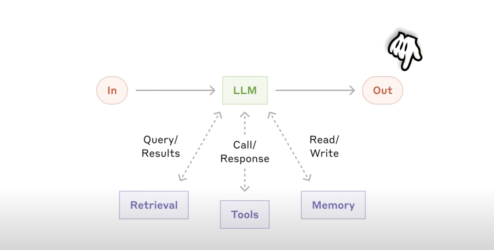
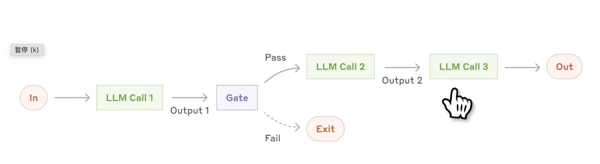
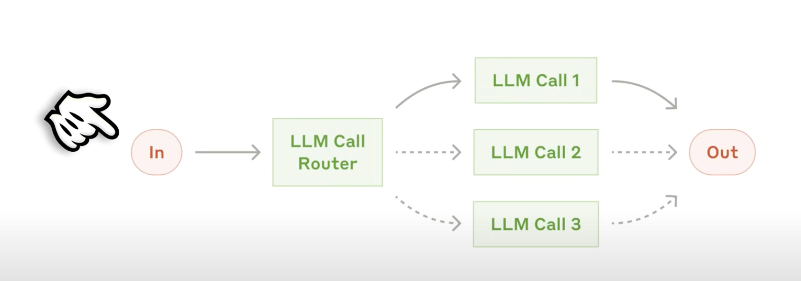
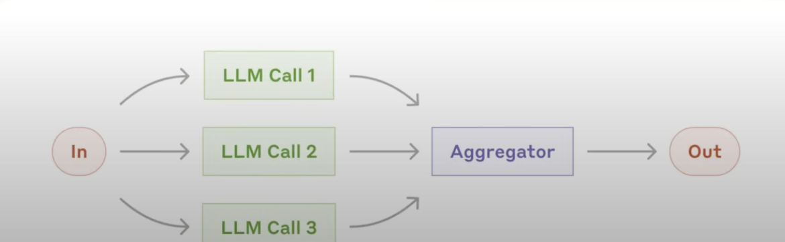
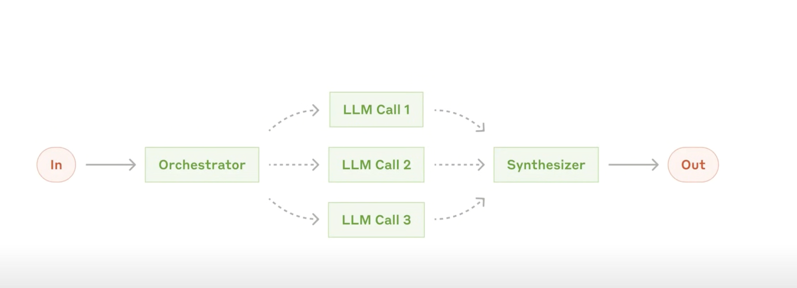
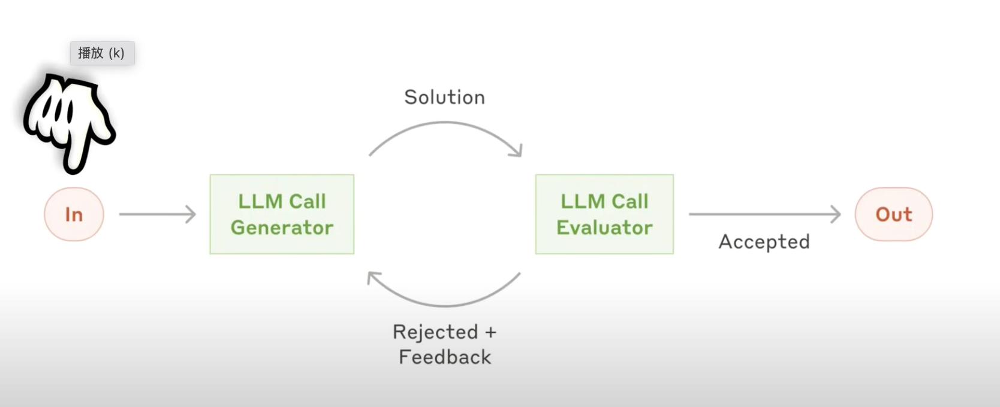

# Building AI Agents in 44 minutes

## AI agent components
https://www.youtube.com/watch?v=_Udb5NC6vTI
- Models
- Tools: Interface to the world, interact with environment, function calling, built-in tools.
- Knowledge and memory: Augments agents with external and persistent knowledge 
- Audio and speech 
- Guardrails: Prevent irrelevant, harmful, or undesirable behavior.
- Orchestration: Develop, deploy, 

## Workflow types

Workflow type 1 : prompt chaining 

Decomposes a task into a sequence of steps, where each LLM call processes the output of the previous one. You can add programmatic checks on any imtermediate steps to ensure that the process is still on track.

Workflow tyoe 2: routing

Routing classifies an input and directs it to a specialized followup task. It allows for separation of concerns, and building more specilizaed prompts. Without this workflow, optimizing for one kind of input can hurt performance on other inputs. 

When to use Routing: for complex tasks where there are distinct categories that are better handled separately, and where calssification can be handled accurately, either by an LLM or a more traditional classification model/algorithm.

Workflow type 3: parallelization

LLMs can sometimes work simultaneously on a task and have their outputs aggregated programmactically. This workdflow, parallelization, manifests into two key variations:
- Sectioning: Breaking a task into independent subtasks run in parallel.
- Voting: Running the same task multiple times to get diverse outputs.

Workflow type 4: Orchestrator-workers

A central LLM dynamically breaks down tasks, delegates them to worker LLMs, and synthesizes their results.

Workflow type 5: Evaluator-optimizer

One LLM call generates a response while another provides evaluation and feedback in a loop.

## AI agent prompts

- Role 
- Task
- Input
- Output
- Constraints
- Capabilitties & reminders

Questions:

- How should you choose an agentic workflow pattern?
- What is an example of a routing user case?
- What are the 6 components to include in an AI agent prompt?

## Implementation of AI agents

Examples:
- Customer support AI agent
- AI news aggregator
- Daily expenses tracker
- Financial research assistant

