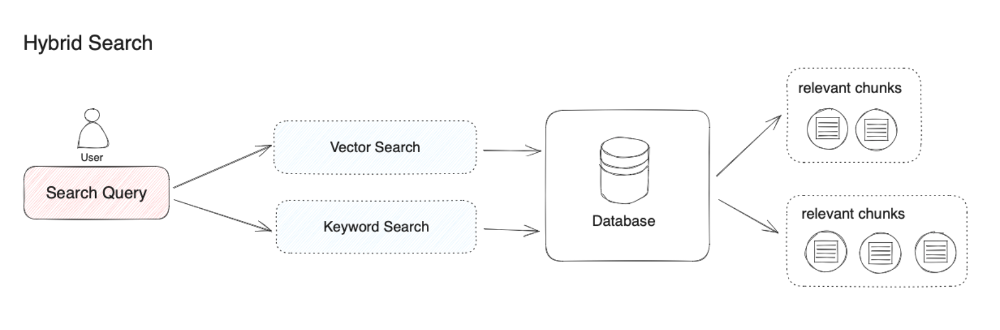

# [Dify RAG](https://mp.weixin.qq.com/s/vmY_CUmETo2IpEBf1nEGLQ)

RAG: 帮助大模型临时性地获得他所不具备的外部知识，允许它在回答之前先找答案。

RAG 系统最核心的是外部知识的检索环节。

- fine-tuning vs RAG: 在达到相似结果时，RAG 在成本效率和实时性能方面有显著优势。fine-tuning 对数据的质量和数量要求很高。应用程序在使用微调模型时可能也需要 RAG。
- 长文本与 RAG：

混合检索

 RAG 检索的主流方法是向量 检索，即语义相关度匹配的方式。通过将外部知识库的文档拆分为语义完整的段落或句子，并通过 embedding 将其转换为计算机能够理解的数字表达（多维向量），

向量检索的优势：
- 复杂语义的文本查找
- 多语言理解（跨语言理解，如输入中文匹配英文）
- 多模态理解（支持文本、图像、音视频等的相似匹配）
- 容错性（处理拼写错误、模糊的描述）

传统关键词搜索的优势：
- 精确匹配（如产品名称、姓名、产品编号）
- 少量字符的匹配（通过少量字符进行向量检索时效果不好，但用户恰恰只习惯输入几个关键词）
- 倾向低频词汇的匹配（低频词汇往往承载了语言中的重要意义，比如“你想跟我去喝咖啡吗？”这句话中的分词，“喝”“咖啡”会比“你”“想”“吗”在句子中承载更重要的含义）

但向量检索在以下情况效果不佳（why）：
- 搜索某一个人或物体的名字
- 搜索缩写词或短语
- 搜索 ID

对大多数文本搜索的场景，首要确保潜在的最相关结果能够出现在候选结果中。

ETL (extract, transform, load)
extract: 从多源易构数据中提取原始内容
transform: 数据转换，将原始数据转化为结构化文本片段
load: 向量化存储，将文本转化为向量并建立索引

