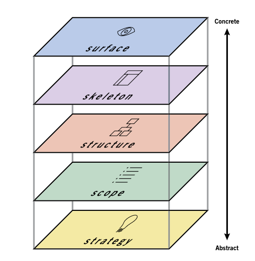
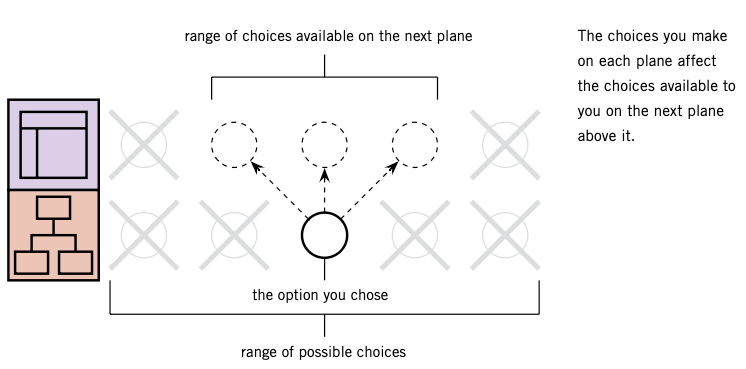
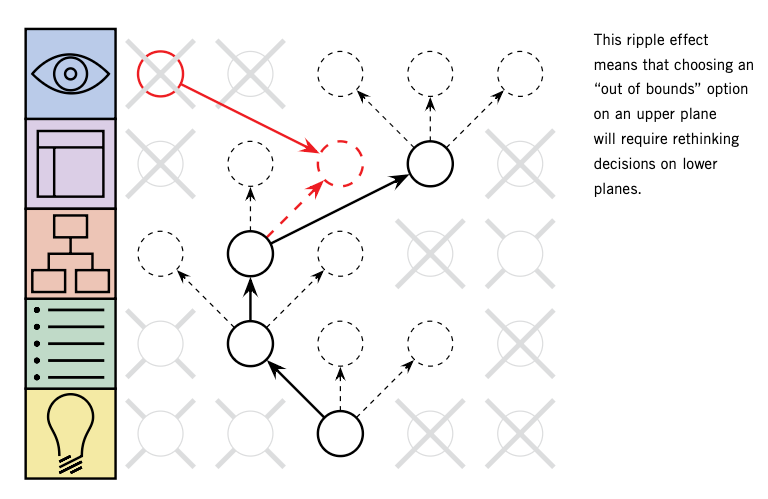
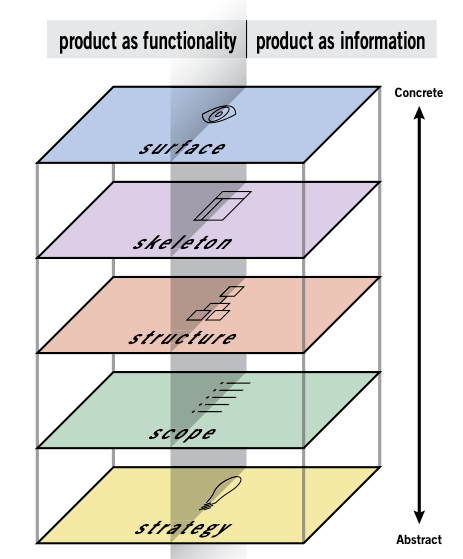
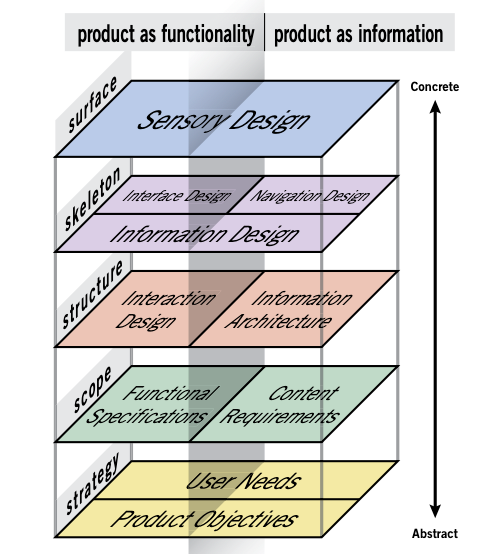

# [Reading notes: The Elements of User Experience](https://www.amazon.com/Elements-User-Experience-User-Centered-Design/dp/0321683684) 

Author: Jesse James Garrett

## Demystifying user experience

Designing a product vs Desigining a user experience 
- Every time a product is used, it delivers an experience. 
- In simple cases, the requirements to deliver a successful user experience are built into the definition of the product itself. In complex products, the requirements to deliver a successful user experience are independent of the definition of the product.
- The more complex a product is, the more difficult it becomes to identify exactly how to deliver a successful experience to the user. User experience is not about the inner workings of a product or service. User experience is about how it works on the outside, where a person comes into contact with it. 

用户体验并不是指产品本身如何工作的，而是产品如何与外界发生联系并发挥作用。对于产品直接面对用户的部分，包括按钮、布局、文字和外观，正确的产品形态绝不是由功能决定的，而是由**用户自身的心理感受和行为**来决定的。

Measuring the user experience
- Customer loyalty 
- Return on ivestment: conversion rate is a common way of measuring the effectiveness of a user experience

User-centered design(还能有不以用户为中心的设计么)
- The user experience design process is all about esnuring that no aspect of the user's experience with your product happens without your conscious, explicit intent. This means **taking into account every possibility of every action the user is likely to take and understanding the user's expectations at evert step of the way through that process**. 考虑到用户有可能采取的每一个行动的每一种可能性，并且去理解在这个过程中每一个步骤中用户的期望值。

Layers of user experience: a conceptual framework for user experience
- the surface plane:
- the skeleton plane: the placement of buttons, controls, photos, and blocks of text
- the structure plane: The skeleton is a concrete expression of the more abstract structure of the site. The skeleton might define the placement of the interface
elements on our checkout page; the structure would define how users got to that page and where they could go when they were finished there. The skeleton might define the arrangement of navigational elements allowing the users to browse categories of products;
the structure would define what those categories were fished there
- the scople plane: The structure defines the way in which the various features and
functions of the site fit together. Whether that feature-or any feature—is included on a site is a question of scope.
- the strategy plane: The scope is fundamentally determined by the strategy of the site.

If you consider your decisions on lower planes to be set in stone before you take on your decisions on higher planes, you will almost certainly be throwing your project schedule—and possibly the suc-
cess of your final product—into jeopardy.

Finish vs start
- Requiring work on each plane to finish before work on the next can start leads to unsatisfactory results for you and your users.
- A better approach is to have work on each plane finish before work on the next can finish.
- You should plan your project so that work on any plane cannot finish before work on lower planes has finished. Do not build the roof of the house before you know the shape of its foundation. 

Basic duality: functional vs information 
- Early in the web UX community, two perspectives emerged: one treated the Web as **an application design problem**, drawing from traditional software and product design practices, while the other viewed it as **an information distribution and retrieval problem**, rooted in publishing, media, and information science.
- The waters were further muddied by the fact that most Web
sites could not be neatly categorized as either functional applica-
tions or information resources—a huge number seemed to be a sort
of hybrid, incorporating qualities from each world.

- On the functionality side, we are mainly concerned with tasks—the steps involved in a process and how people think about completing them. Here, we consider the product as a tool or set of tools
that the user employs to accomplish one or more tasks.
- On the opposite side, our concern is what information the product offers and what it means to our users. Creating an information-rich user experience is about enabling people to find, absorb, and make
sense of the information we provide.

## Elements of user experience

### The strategy plane
- Product objectives: what do we want to get out of this product
- User needs：what do our users want to get out of it 

Knowing both what we want the product to accomplish for our organization and what we want it to accomplish for our users informs the decisions we have to make about every aspect of the user experience.

#### Product objectives

#### User needs
User segmentation
- User segmentaion is just a means to the end of uncovering user needs. We just get as many as different segmentss to stay informed. 
- We do user segmentation not because different groups have different needs but also those needs are in direct opposition. 用户定位是新手还是熟手，这两者的需求完全不同。We cannot meet both sets of user needs with a signle solution: either focus on one user segment to the exclusion of the other, or to provide a range of options for all users.

Usability and user research
- surveys, interviews, or focus groups: gathering information about the general attitudes and perceptions of users 收集用户普遍的观点与感知
- user tests or field studies: understanding specific aspects of user behavior and interaction with your product 理解具体的用户行为以及用户在和产品交互时的表现

### The scope plane

What will be included in AI

Strategy becomes scope when you translate user needs and product objectives into specific requirements for what content and functionality the product will offer to users(要提供什么样的内容和功能就是范围)。

Defining the scope of your project is both: a valuable process that results in a valuable product.
- The process is valuable because it forces you to address potential conflicts and rough spots in the product while the whole thing is still hypothetical. "过程“的价值在于，当整件事还处于假设阶段，它能迫使你去考虑潜在的冲突和产品中一些粗略的点，然后确定现在能解决哪些事情，哪些事情需要迟一点才能解决。
- The product is valuable because it gives the entire team a reference point for all the work to be done throughout the project and a common language for talking about that work. "产品“的价值在于，被定义的这个产品给了整个团队一个参考点，明确了这个项目中要完成的全部工作。

On the functionality side, the strategy is translated into scope through the creation of functional specifications: a detailed description of the “feature set” of the product. On the information
side, scope takes the form of content requirements: a description of the various content elements that will be required

### The structure plane

interaction design and information architecture: **developing a conceptual strcuture for the site**.

#### Interaction design
Interaction design is concered with describing possible user behavior and defining how the system will accommodate and respond to that behavior. 关注描述“可能的用户行为：，同时定义”系统如何配合与响应”这些用户行为。

#### Conceptual model: how the interactive components we create will behave.

Knowing your conceptual model allows you to make **consistent design decisions**. It doesn't matter whether the content element is a place or an object; what matters is that the site behaves consistently. instead of treating the element as a place sometimes and an object at other times.

conceptual models are used consistently throughout the development of the interaction design. 

#### Error handling 

user error—what does the system do when people make mistakes, and what can the system do to prevent those mistakes from happening in the first place. 如何阻止用户犯错、用户犯错如何处理

- design the system so that errors are simply impossible
- make errors merely difficult
- help users catch errors after they've happened

#### Information architecture

top-down approach: 

bottom-up approach:

#### Langugage and metadata
nomenclature 命名原则：the descriptions, labels, and other terminologu the site uses.

Very essential: use the language of your users and to do so in a consistent fashion. The tool we use to enforce that consistency is called a controlled vocabulary. 

受控词典时网站使用的一套标准语言。这是用户研究中很重要的一个领域，与用户谈话并了解他们的沟通方式，是开发出一个让用户感到自然的命名原则系统的最有效方式。

控制词汇的另一种较为精细的应用方法，就是创造“类词词典”（thesaurus）。

The scope is given structure on the functionality side through interaction design, in which we define how the system behaves in response to the user. For information resources, the structure is
the information architecture: the arrangement of content elements to facilitate human understanding.

### The skeleton plane

框架层，进一步提炼结构，确定很详细的界面外观、导航和信息设计。

On the skeleton plane, we further refine that structure, identifying specific aspects of interface, navigation, and information design that will make the intangible strcuture concrete.

- interface design: 提供给用户做某些事的能力
- navigation design: 提供给用户去某个地方的能力
- information design: 传达想法给用户

The skeleton plane breaks down into three components. On both sides, we must address information design: the presentation of information in a way that facilitates understanding. For functionality-oriented products, the skeleton also includes interface design, or arranging interface elements to enable users to
interact with the functionality of the system. The interface for an information resource is its navigation design: the set of screen elements that allow the user to move through the information
architecture. 

- checkbox
- radio buttons
- text fields
- dropdown lists
- list boxes
- action buttons

Information Design

### The surface plane
Regardless of whether we are dealing with a functionality-oriented product or an information resource, our concern here is the same: the sensory experience created by
the finished product. 更多是审美层面，完成其他4个层面的所有目标，并同时满足用户的感官感受。

框架层解决的是放置的问题：界面设计考虑交互元素的布局，导航设计考虑如何引导用户移动的元素安排，信息设计考虑如何安排传达给用户的信息要素。
而surface plane解决的是这些元素交互的感知问题。Through attention to information design, we determine how we should group and arrange the information elements of the page; through attention to visual design, we determine how that arrangement should be presented visually.

关于视觉：与其用“什么具有美感”来评估一个视觉设计方案，更应该关注：它们的运作是否良好。对于那些之前层面就确定好的目标，视觉设计给它们的支持效果如何？

如何评估视觉：你的视线首先落在什么地方？哪个组件会第一时间吸引用户的注意力？用户第一时间注意到的东西与他们或者你的目标背道而驰吗？

如何找到最显眼的设计元素：问别人或者眯着眼睛看这个页面。

如何你的设计是成功的：
- 遵循的是一条流畅的路径。用户的眼睛不能左看右看，所有元素都在试图引起他们的注意。
- 不需要用太多细节来吓到用户的前提下，为用户提供有效选择、某种可能的引导。1）引导用户完成快速完成此刻的目标/任务 2）不应该分散用户对完成目标的注意力

用户在页面上的视线移动并不是随机的，是一种所有人类共有的、对于视觉刺激而产生的、一系列复杂的原始本能反应。总体策略事，这些差异要足够清晰，让用户能够分辨出某个设计选择是特意要传达一些信息。

## Using the elements
The elements of user experience remain consistent no matter how complex your product is. But putting the ideas behind the elements
into practice can sometimes seem like a challenge all by itself. **It’s not just a question of time and resources—it’s often a question of mindset.**（如何理解是mindset）

Designing the user experience is really little more than a very large collection of very small problems to be solved. The difference between a successful approach and one doomed to failure really
comes down to two basic ideas:
- Understand what problems you're trying to solve(确认是哪个层面的问题：策略层、范围层、结构层、框架层、表现层) 比如一个紫色的按钮是问题，是按钮太大还是紫色不合适（表现层）、还是这个按钮的位置放得不对（框架层）、还是这个按钮表示的功能不是用户期望的（结构层）
- Understand the consequences of your solution to the problem. 

用户体验做决策的场景：
- Design by default. 根据现有的技术和业务现状决定的，比如公司把用户的数据放在了不同的数据库，但其实从用户体验角度看，放在一个数据库会更好。
- Design by mimicry /ˈmɪm.ɪ.kri/. 产品设计靠参考其他产品，没有考虑这些设计本身对我们自己的用户是否合适。
- Design by fiat /ˈfiː.æt/. 领导决定的设计。

### Asking the right questions
做产品设计，不能依赖用户来说清楚他们的需求，要比他们更了解他们的需求（cannot depend on your users to articulte their needs）。也不能依赖测试，测试可以帮助你了解用户的需求，但它只是达到目的的其中一种方式。

